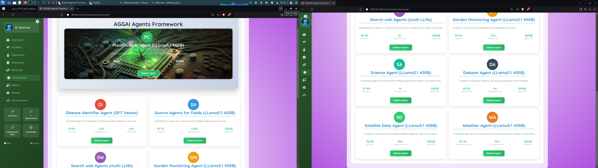
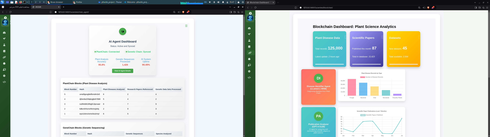

# Pflastik - AI Agent Framework for Plant Disease Identification

Pflastik is a multi-user AI-driven platform designed to identify plant diseases, targeting scientists, farmers, and plant enthusiasts. The project incorporates blockchain technology to ensure data integrity and provides advanced AI methods for analyzing plant genomes, focusing on tomato DNA.

## Features
- AI-driven plant disease identification.
- Blockchain integration for data security and immutability.
- Binary data conversion into DNA sequences.
- User-friendly interface for various stakeholders in agriculture.

## Prerequisites
Make sure you have the following installed:
- Python 3.8+
- Git

## Installation

1. **Clone the repository:**
    ```bash
    git clone https://github.com/AElnamaki/pflastik.git
    cd pflastik
    ```

2. **Create a virtual environment (optional but recommended):**
    ```bash
    python3 -m venv venv
    source venv/bin/activate   # On Windows: venv\Scripts\activate
    ```

3. **Install the requirements:**
    ```bash
    pip install -r requirements.txt
    ```

## Running the Application

1. **Run the application:**
    ```bash
    python manage.py runserver
    ```

2. **Access the app:**
    Open your web browser and go to `http://127.0.0.1:8000/` to see the platform in action.

# AI Framework Interface



# Blockchain Interface




## Contributing

Contributions are welcome! Please feel free to submit a Pull Request or open an issue for any bugs or feature requests.

## License

This project is licensed under the MIT License.
